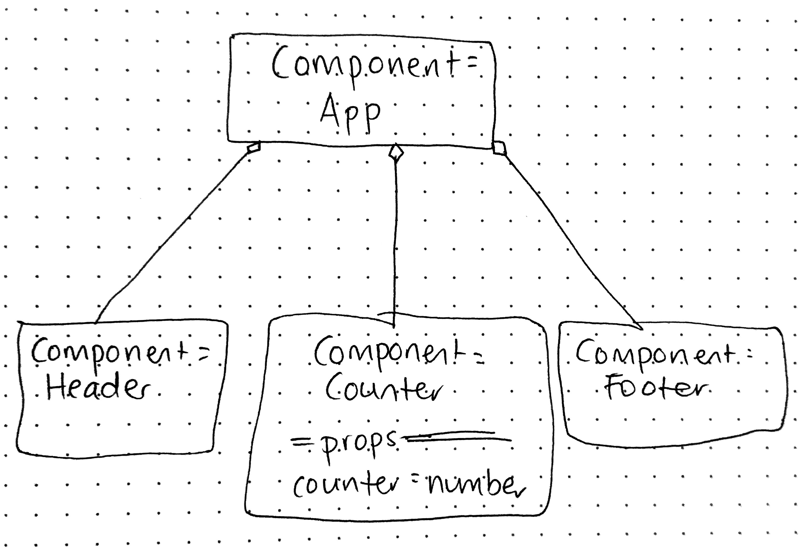

# LAB - 26

## React - Component Based UI

### Author: Joanna Arroyo

### Links and Resources
* [submission PR](https://github.com/joanna-401-advanced-javascript/lab-26-components/pull/1)
* Code runs locally instead of on Code Sandbox

### Setup
#### Running the app
* `npm start`

#### UML
